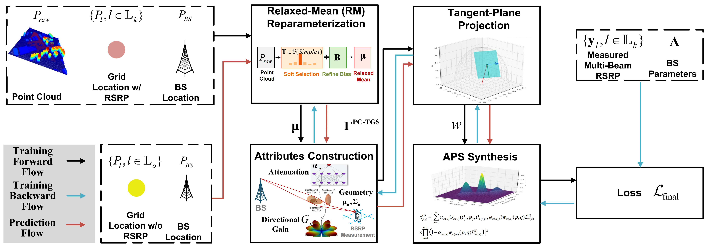

# PC-TGS: Point-Cloud-Assistant Localized Statistical Channel Prediction by Tangent Gaussian Splatting

Ye Xue, Yiheng Wang, Xinhua Shao, Qi Yan, Shutao Zhang, Tsung-Hui Chang

[](https://doi.org/10.1109/TWC.2026.3696997)
[](https://github.com/yeehengwang/HUAWEI-RF-3DGS-Project)
[](https://chenjiadie.github.io/PC-TGS/)



We are excited to share the code for PC-TGS, the first framework to extrapolate channel angular power spectrum (APS) to unmeasured outdoor locations by integrating sparse radio measurements with dense LiDAR-based geometry. We hope this repository serves as a useful starting point for researchers and engineers working at the intersection of wireless communication and 3D scene representation.

---

## Overview

PC-TGS extends 3D Gaussian Splatting (3DGS) to the radio frequency domain for localized statistical channel prediction (LSCP) — extrapolating channel angular power spectrum (APS) to unmeasured locations from sparse RSRP measurements and dense point cloud priors.

Key highlights:
- **Relaxed-Mean (RM) reparameterization**: selects and refines key virtual scatterers from noisy, dense LiDAR point clouds
- **Tangent-plane projection**: maps 3D Gaussians onto the local angular domain at each bin — no camera parameters needed
- **GWA-based closed-form APS integration**: a provable Gaussian-weighted average approximation with rigorous error bounds
- **Recursive fine-tuning**: progressively propagates learned multipath structure from measured regions into uncovered areas

### Performance (City A Dataset, 5M LiDAR points, 6,310 grids)

| Method | ST-1 (dB) | ST-2 (dB) | ST-3 (dB) | Inf. ST-1 (ms) | Inf. ST-2/3 (ms) |
|--------|-----------|-----------|-----------|----------------|------------------|
| WNOMP | 6.12 | 13.35 | 15.07 | 1.5 | 8,032 |
| TMSBL | 6.03 | 11.69 | 11.77 | 134 | 9,743 |
| Ray Tracing | — | 14.37 | 16.77 | — | 8,100 |
| RadioUNet | — | 10.31 | — | — | 2.1 |
| SM-LSCM | 5.89 | 10.02 | 11.14 | 99 | 99 |
| MM-LSCM | 5.76 | 9.12 | 9.94 | 384 | 384 |
| **PC-TGS (ours)** | **5.57** | **7.45** | **7.57** | **74** | **74** |

ST-1: rotated RSRP @ measured grids · ST-2: RSRP @ unmeasured grids · ST-3: rotated RSRP @ unmeasured grids

---

## Quick Start

### Environment

```bash
# Python >= 3.8, CUDA-enabled GPU
pip install numpy scipy h5py pyyaml tqdm einops matplotlib
pip install torch torchvision torchaudio  # match your CUDA version
```

> **Note:** The training dataset used in this work is proprietary and not publicly available. To use this code with your own data, prepare files matching the format expected by `datasets_aps_new.py` (see the dataset classes for required fields and shapes).

### Training

```bash
python train_radsplatter_new.py \
  --config ./radsplatter_setting_new.yml \
  --gpu 0 \
  --mode train \
  --num_scatters 2000 \
  --world_size 1 \
  --num_max_angles 800 \
  --sh_up_iter 500
```

### Evaluation

```bash
python train_radsplatter_new.py \
  --config ./radsplatter_setting_new.yml \
  --gpu 0 \
  --mode test \
  --num_scatters 2000 \
  --world_size 1 \
  --num_max_angles 800
```

---

## Repository Structure

```text
HUAWEI-RF-3DGS-Project/
├── README.md
├── radsplatter_setting_new.yml         # Training and optimizer configuration
├── train_radsplatter_new.py            # Main training/testing entrance
├── radsplatter_model.py                # PC-TGS model (RM, SH coefficients, scatterer attributes)
├── radsplatter_render.py               # Tangent-plane projection + electromagnetic splatting
├── datasets_aps_new.py                 # Dataset loaders for RSRP and APS data
├── projection_utils.py                 # 3D-to-angular projection + Jacobian computation
├── complex_sh_utils_new.py             # Complex spherical harmonic evaluation
├── sh_utils.py                         # Real spherical harmonic utilities
├── pdf_utils.py                        # Gaussian PDF computation
├── prune_utils.py                      # Mahalanobis-based Gaussian filtering
├── loss_utils.py                       # Loss functions (L1, L2, SSIM, SmoothL1)
├── data_painter.py                     # APS visualization and data processing
└── utils.py                            # General tensor and rotation utilities
```

### Data Format

The training data is proprietary. To use this code with your own data, prepare files in the format expected by `datasets_aps_new.py`.

---

## Citation

If you find this work helpful, please cite:

```bibtex
@article{xue2026point,
  title={Point-Cloud-Assistant Localized Statistical Channel Prediction by Tangent Gaussian Splatting},
  author={Xue, Ye and Wang, Yiheng and Shao, Xinhua and Yan, Qi and Zhang, Shutao and Chang, Tsung-Hui},
  journal={IEEE Transactions on Wireless Communications},
  volume={25},
  pages={17816--17830},
  year={2026},
  publisher={IEEE},
  doi={10.1109/TWC.2026.3696997}
}
```

---

If you encounter any issues or have suggestions, feel free to open an issue or submit a pull request.

---

## License

This project is licensed under the [MIT License](https://opensource.org/licenses/MIT).
